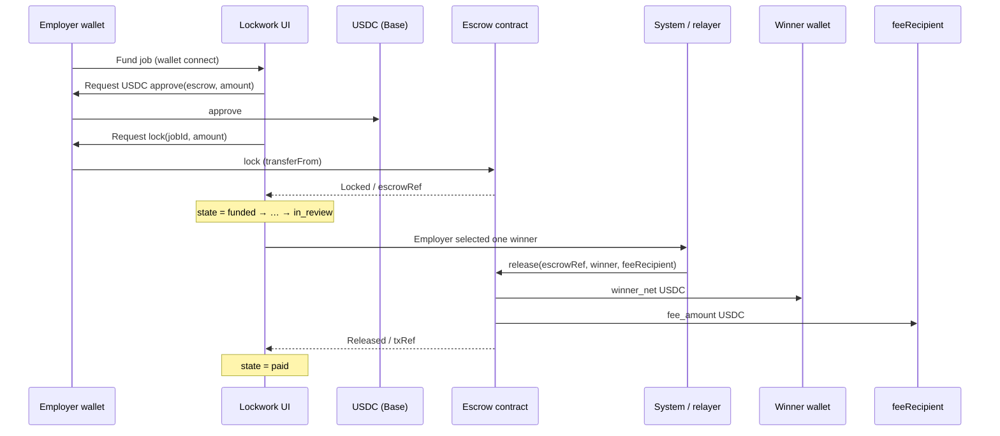
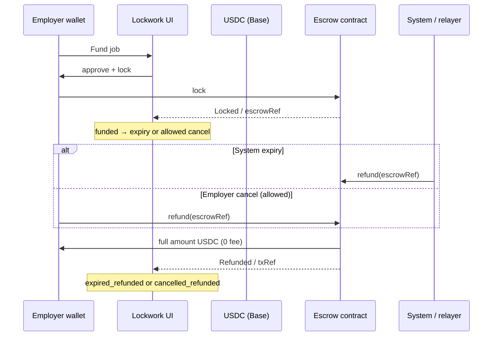

# On-chain escrow adapter — Base L2 + USDC

*Lockwork · Crypto Bro draft for Dante Final · 2026-09-26*  
*Status: **DRAFT** — no deploy, no spend, no mainnet/testnet publish until Dante approves open items below.*

Plugs into the hybrid model in [`PAYOUT_HYBRID.md`](./PAYOUT_HYBRID.md). Shared job escrow states and `EscrowAdapter` surface are identical; this file specifies the **on-chain** path only.

---

## Goal

- Ship a second payout rail: **Base L2 + USDC** escrow that mirrors custodial-sim states and UI.
- Same trust story as hybrid: money locked before submissions open; exactly one winner gets paid; refunds return capital to the employer.
- Platform fee **250 bps** skimmed **only** on outward `release` to a winner (parity with custodial).

## Non-goals (v1)

| Out of v1 | Why |
|-----------|-----|
| Multi-chain | One chain: **Base**. No Ethereum mainnet, Arbitrum, Optimism, Solana, etc. |
| Multi-stablecoin | One coin: **USDC** (6 decimals). No USDT/DAI/ETH-native payouts. |
| Worker-triggered moves | Workers never call `lock` / `release` / `refund`. |
| Nested on-chain carve-outs | Tree carve-outs stay custodial/ledger in v1; on-chain escrows are flat job deposits. Nested D1 fee *incidence* still documented for when trees land on-chain. |
| Disputed state automation | `disputed` is v2 (same as PAYOUT_HYBRID). |
| Custodial ↔ on-chain bridge mid-job | Rail chosen at fund time; no mid-flight migration. |
| Deploy / mainnet | This doc + TypeScript types only. No bytecode, no keys, no broadcast. |

---

## Shared escrow states

Identical to [`PAYOUT_HYBRID.md`](./PAYOUT_HYBRID.md):

```
draft → funded → in_review → paid
                ↘ expired_refunded
                ↘ cancelled_refunded
                ↘ disputed (v2)
```

| State | On-chain meaning |
|-------|------------------|
| `draft` | Job written; no USDC locked |
| `funded` | USDC deposited in escrow contract under `jobId` / `escrowRef` |
| `in_review` | Deadline / early close; contract still holds funds |
| `paid` | `release(winner, feeRecipient)` executed |
| `expired_refunded` | `refund(employer)` after timeout rules |
| `cancelled_refunded` | `refund(employer)` under allowed cancel |
| `disputed` | v2 — not implemented |

Adapter status mapping: `funded` → `funded`; after release → `released`; after refund → `refunded`; missing/unknown ref → `unknown`.

---

## EscrowAdapter interface (match PAYOUT_HYBRID)

```ts
interface EscrowAdapter {
  lock(jobId: string, amount: bigint, currency: string, payer: string): Promise<string>; // → escrowRef
  release(escrowRef: string, winnerPayee: string): Promise<string>;                      // → txRef
  refund(escrowRef: string, reason: string): Promise<string>;                            // → txRef
  status(escrowRef: string): Promise<'funded' | 'released' | 'refunded' | 'unknown'>;
}
```

On-chain concrete types live in [`stub/onchain/escrowAdapter.types.ts`](./stub/onchain/escrowAdapter.types.ts). Fee helpers in [`stub/onchain/feeMath.ts`](./stub/onchain/feeMath.ts).

---

## Concrete Base + USDC constants

| Constant | Value | Notes |
|----------|-------|--------|
| Chain | Base (Coinbase L2) | Prefer Base over mainnet for gas UX |
| Chain ID | `8453` (mainnet) / `84532` (Base Sepolia test) | Wire via config; never hardcode only mainnet |
| USDC (Base) | `0x833589fCD6eDb6E08f4c7C32D4f71b54bdA02913` | **VERIFY-BEFORE-DEPLOY** — well-known Circle USDC on Base; re-check Circle docs + BaseScan before any deploy |
| USDC decimals | `6` | Integer math in minor units |
| Native gas token | ETH on Base | Employer pays gas for approve + lock; system/relayer may pay release/refund gas |
| Escrow contract | *TBD — Dante approval* | Not deployed; address blank until audit + go |
| `feeRecipient` | *TBD — Dante approval* | Platform treasury wallet; key custody risk (see Risks) |

> **Flag:** Treat `0x833589fCD6eDb6E08f4c7C32D4f71b54bdA02913` as the candidate Base USDC address. Crypto Bro / agents must re-verify on Circle + BaseScan immediately before any testnet/mainnet deploy. Do not assume this doc stays current.

---

## Fee math

Aligned with PAYOUT_HYBRID + MONEY_MODEL + OPEN_DECISIONS D1:

| Rule | Value |
|------|-------|
| `platform_fee_bps` | **250** (2.5%) |
| Fee event | **Only** outward `release` to a winner |
| Lock | **0** fee |
| Refund (`expired_refunded` / `cancelled_refunded`) | **0** fee |
| Carve-outs (`parent_carveout`) | **0** fee (D1) |
| Expansion | Fee when *that* capital later releases outward |

Integer math (USDC 6 decimals, no floating point):

```
fee_amount  = amount * 250 / 10000     // floor division
winner_net  = amount - fee_amount
```

Example: `amount = 4_000_000000` (4000 USDC) → `fee_amount = 100_000000` (100 USDC) → `winner_net = 3_900_000000` (3900 USDC).

Helpers: [`stub/onchain/feeMath.ts`](./stub/onchain/feeMath.ts).

### Nested D1 rule pointer

**Leaf-outward only.** See [`OPEN_DECISIONS.md`](./OPEN_DECISIONS.md) § D1 (PROPOSED until Dante confirms). On-chain v1 escrows are flat, but release-service fee incidence must still follow D1 when nested jobs exist on any rail: charge 250 bps only when money leaves the company tree to a winner payee; never on carve-out transfers or refunds.

---

## Who may trigger what

| Action | Actor | Notes |
|--------|--------|------|
| `lock` | **Employer** (wallet signs deposit) | When posting/funding; workers never lock |
| `release` | **System** and/or **employer** after exactly one winner selected | Relayer or employer tx; never worker |
| `refund` | **System** on expiry; **employer** on allowed cancel | Never a worker |
| Workers | — | **Never touch** escrow (no approve, no call, no claim path in v1) |
| Lead bots | — | No fund moves unless future treasury role (out of v1) |

Winner address is an **oracle/input** from the product layer (employer picked winner). Spoofed winner is an explicit risk — see below.

---

## Contract sketch

Not production Solidity — sketch for adapter design only.

```
// keyed by jobId / escrowRef
struct Deposit {
  address employer;
  uint256 amount;       // USDC 6-dec
  address winner;       // set at release or zero
  uint8   state;        // Funded | Released | Refunded
}

function lock(bytes32 jobId, uint256 amount) external;
  // pulls USDC via transferFrom(employer); emits Locked(jobId, employer, amount, escrowRef)

function release(bytes32 escrowRef, address winner, address feeRecipient) external onlyRole;
  // fee = amount * 250 / 10000;
  // transfer USDC: winner ← amount - fee; feeRecipient ← fee
  // emits Released(escrowRef, winner, feeRecipient, fee, winnerNet)

function refund(bytes32 escrowRef) external onlyRole;
  // transfer full amount back to employer; emits Refunded(escrowRef, employer, amount)
```

**Events (minimum):** `Locked`, `Released`, `Refunded`.  
**Auth:** `onlyRole` = employer-for-own-escrow and/or platform relayer after product state machine says OK. Workers have no role.  
**Reentrancy:** checks-effects-interactions + nonReentrant on release/refund.  
**No worker `claim()` in v1** — release is push, not pull.

---

## Sequence diagrams

### Fund → release



### Fund → refund



---

## Integration order

Per PAYOUT_HYBRID v1 order:

1. Shared state machine + DB (`rail`, `escrow_ref`, `amount`, `currency`, `state`) — already in model.
2. **Custodial-sim** in-process — **already first**; full contest UI works end-to-end.
3. Custodial-live (payments provider) when ready.
4. **This on-chain adapter** — **second path**; same UI; wallet connect only on fund.

Hybrid product meaning: both rails first-class in the model; shipping order stays custodial-sim → custodial-live → on-chain without rewriting jobs.

Tiny comment pointer only in `stub/server.js` if needed later — do not change behavior in this draft pass.

---

## Gas / UX notes

- **Base preferred** for low fees vs Ethereum mainnet; still show gas estimate before lock.
- Typical employer flow: **connect wallet → approve USDC → lock**. Two signatures unless permit/712 later (out of v1).
- Prefer ERC-20 `approve` + `transferFrom` for clarity; Permit2 optional later.
- Release/refund can be relayer-paid gas so employers/winners aren’t stuck; document who pays.
- Wrong-network rejection: UI must refuse lock if wallet chain ≠ Base (8453 / configured test id).
- Show amount in USDC human units; store/compare in 6-dec integers.

---

## Explicit risks

| Risk | Mitigation (draft) |
|------|---------------------|
| **Wallet UX friction** | Approve + lock = two txs; educate; Base gas keeps cost low |
| **Key custody of `feeRecipient`** | Multisig / hardware / role separation; never a hot single EOA for mainnet fees |
| **Reentrancy** | nonReentrant + CEI on release/refund; no external calls before state flip |
| **Wrong chain** | Hard check chainId; refuse deposits on non-Base |
| **Spoofed winner oracle** | Winner set only after product auth; release restricted to system/employer roles; never trust client-supplied winner without session/auth |
| **USDC address spoof / wrong token** | Pin verified address; verify-before-deploy checklist |
| **Stuck funds** | Clear refund paths; pause + rescue only with Dante-approved admin design (open item) |
| **D1 not yet Dante-locked** | Fee incidence still PROPOSED in OPEN_DECISIONS — do not harden contract fee events that contradict a future Dante flip |

---

## Open items — need Dante approval before any deploy

- [ ] Confirm **Base-only + USDC-only** v1 scope
- [ ] Confirm / re-verify USDC address `0x833589fCD6eDb6E08f4c7C32D4f71b54bdA02913` at deploy time
- [ ] Lock **OPEN_DECISIONS D1** (leaf-outward fee) — or explicitly reject
- [ ] Choose **`feeRecipient`** custody model (multisig threshold, signers)
- [ ] Approve **relayer** model for release/refund gas (who pays, which keys)
- [ ] Decide testnet first (Base Sepolia) vs delayed mainnet
- [ ] Audit / review gate before mainnet bytecode
- [ ] Pause / rescue / upgrade policy (immutable vs proxy)
- [ ] Whether nested carve-outs ever move on-chain (v1: no)

**Crypto Bro / agents: do not deploy, fund, or broadcast until Dante checks the boxes above and says go.**

---

## Related

- [`PAYOUT_HYBRID.md`](./PAYOUT_HYBRID.md) — shared states + adapter
- [`OPEN_DECISIONS.md`](./OPEN_DECISIONS.md) — D1 nested fee (proposed)
- [`MONEY_MODEL.md`](./MONEY_MODEL.md) — 250 bps economics
- [`stub/onchain/escrowAdapter.types.ts`](./stub/onchain/escrowAdapter.types.ts)
- [`stub/onchain/feeMath.ts`](./stub/onchain/feeMath.ts)
